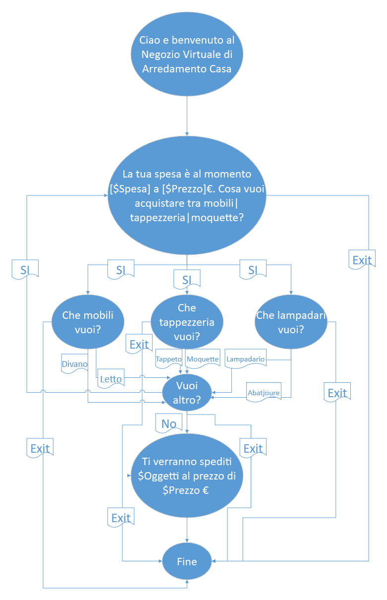
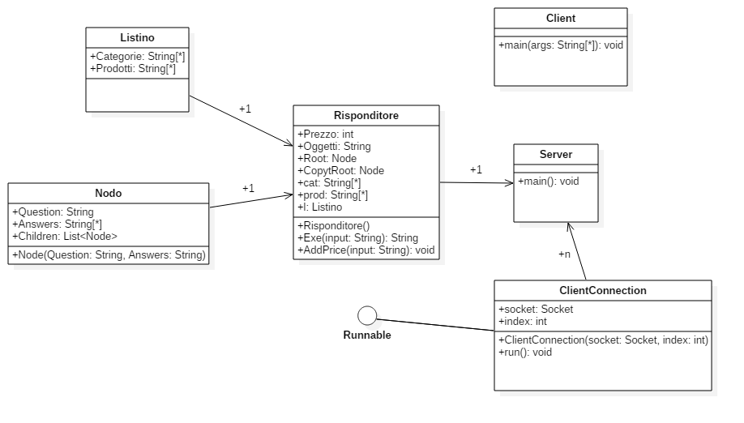

# Risponditore Automatico

### Progettista: Manuele Lucchi
### Classe: 5IC
### Istituto: ITIS C.Zuccante
### Strategie: Ho usato un albero classico non binario come automa. Per attraversarlo non ho usato la ricorsione ma un semplice ciclo che ogni volta assegnava a Root il nodo successivo, questo per aumentare le prestazioni. Per tornare al nodo iniziale all'inizio faccio una copia di Root che dopo assegno a quest'ultima. Semplicemente si sceglie la categoria di prodotto, il prodotto e se si vuole altro, si torna all'inizio, dove verrà visualizzata la spesa corrente
### Note Generali: Il file UML è quello dell'intero progetto, Il file DMG è il sorgente del progetto con il quale ho creato l'immagine PNG con l'Automa. Il programma si chiama Fresh Diagrams. 
### Note Automa: Tutti gli stati puntano ad exit percchè l'utente può scegliere di uscire in qualsiasi momento. Le parole con il $ affianco sono delle variabili che vengono aggiornate assieme alle frasi dell'albero. Dentro i cerchi blu ci sono le domande, nei rettangoli a fianco delle frecce le risposte possibili

### AUTOMA

### UML RISPONDITORE
