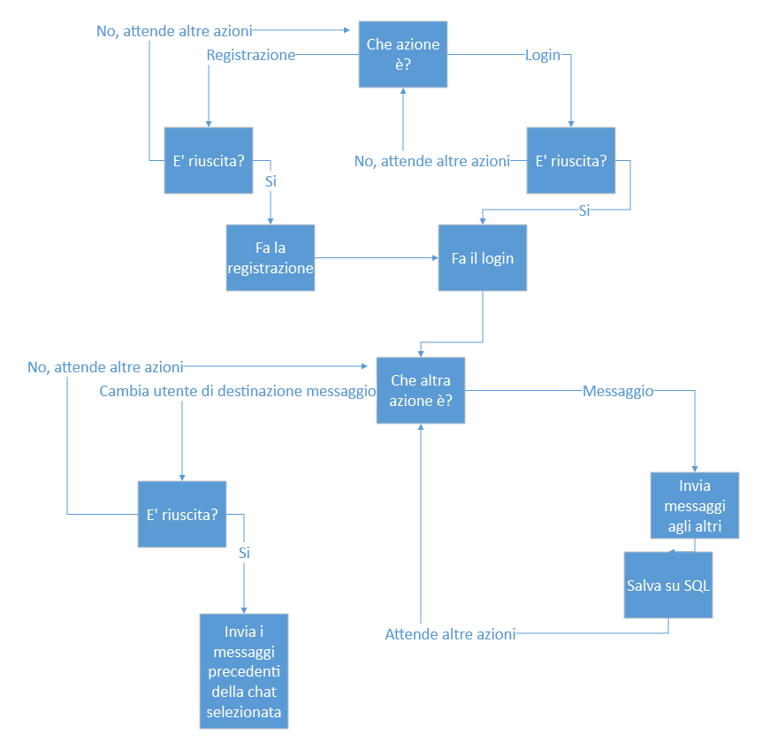
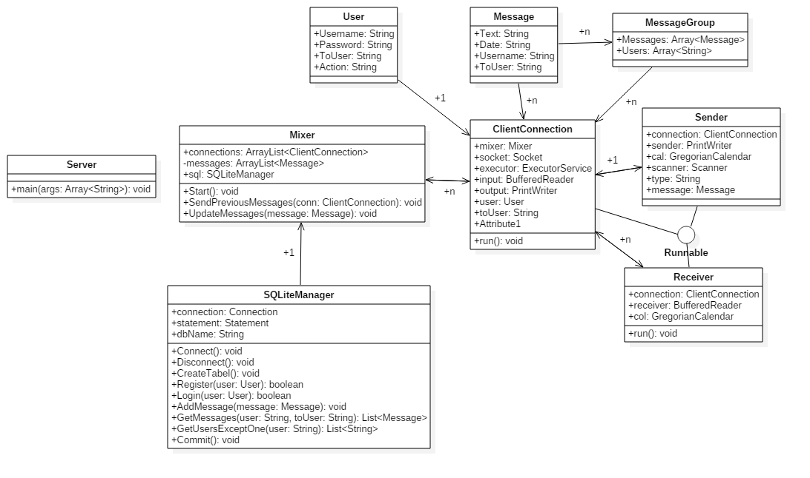

# Chat TCP

### Progettista: Manuele Lucchi
### Classe: 5IC
### Istituto: ITIS C.Zuccante

### Struttura Cartella
* Cartella Client: contenente i sorgenti del Client
* Cartella Server: contenente i sorgenti del Server
* Protocollo.dmg: sorgente del progetto per l'automa a stati finiti del protocollo, fatto con FreshDiagrams
* Protocollo.png: immagine finale dell'automa
* Chat.mdj: sorgente del progetto per il diagramma di classi, fatto con Star UML
* README.md: questo file 

### Strategie Client
Il client è sviluppato in Electron, React.js, WinJS, Bootstrap e ES6, per le spiegazioni dei seguenti framework premere [qui](#spiegazioni-tecniche). 
Il client riceve dal server una stringa Json, ne controlla il contenuto e in base a questo fa le seguenti azioni:
* Aggiornare i messaggi
* Aggiornare i contatti esistenti
* Confermare Login/Signup

### Strategie Server
Il Server è composto da 4 file: 
* SQL Manager, per gestire tutti i comandi SQL
* Message per le classi dei messagi
* User per le classi degli utenti e infine
* Server che è la classe principale.
Il server fa partire un oggetto Mixer che contiene tutte le connessioni, l'oggetto per interagire con l'sql e la lista con tutti i messaggi. Dopo aver stabilito la connessione e aver aggiornato la lista di connessioni, il server riceve stringhe che convertirà in json, e in base al loro contenuto farà determinate azioni, come smistare i messaggi e salvarli, login e registrazione

## Spiegazioni Tecniche 
* Electron è un framework basato su Node.js che crea un webwrapper basato su Chromium, con accesso tramite moduli nativi al filesystem e alle funzioni dell'os. 
* Node.js è una versione standalone dell'interprete JavaScript V8, capace di funzionare al di fuori del browser
* React.js è un framework JavaScript che crea un DOM virtuale e permette di dividere in diversi Tag customizzati il codice html. Tutto poi viene transcompilato in JavaScript ahead of time e in runtime viene appeso all'Index.html
* ES6 è la versione 6 di Javascript, che non può essere eseguita direttamente, per questo viene tradotta in Javascript ES5
* WinJS e Bootstrap sono framework CSS

### PROTOCOLLO

### UML CHAT
