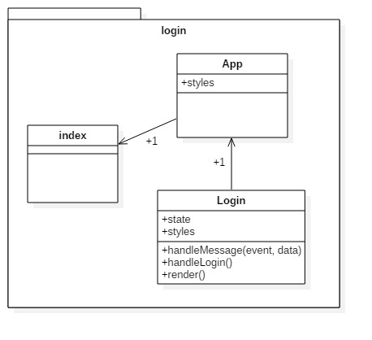
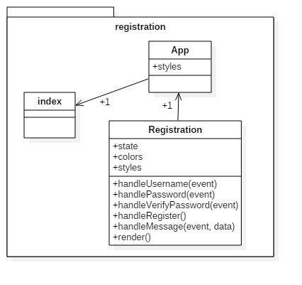
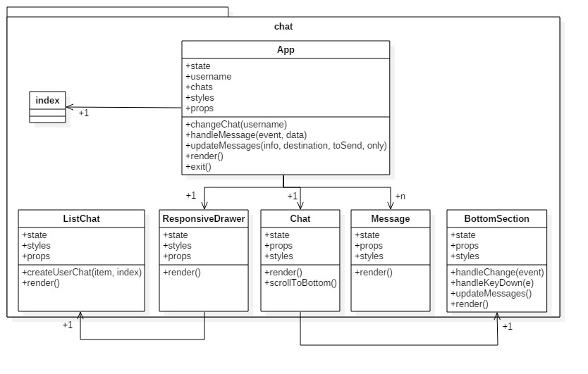
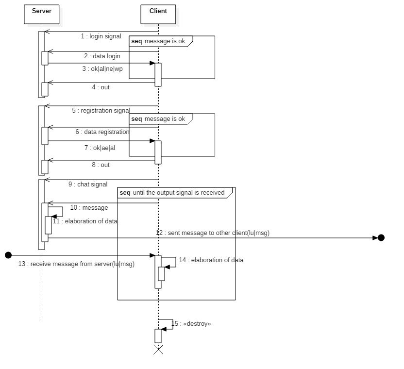

# Chat TCP
Questo progetto consiste in un server ed un client che permetteno agli utenti collegati di comunicare tra di loro. Gli utenti, prima di entrare nella sezione della chat vera e propria, passano per una fase di login o registrazione. Ad ogni accesso alla sezione della chat, vengono caricati tutti i messaggi scritti in precedenza e anche una lista contenente tutti gli utenti e il loro relativo stato (online/offline). Gli utenti possono comunicare in due modi: 
* Attraverso una chat room in cui tutti gli utenti possono comunicare tra di loro
* Direttamente con un altro utente deciso 

### Spiegazione del progetto
#### Client
Il client è stato scritto utilizzando un framework chiamato electron che permette di scrivere applicazioni desktop usando le tecnologie del web: html, css e javascript (backend e frontend). Per il frontend è stato usato un framework chiamato react.js associandovi una libreria per il material-design. Per il backend è stato usato un framework chiamato node.js. 
Il client si divide in 4 sezioni: 
* Login  
Permette all' utente di connettersi alla sezione della chat con un'utente preregistrato ed è utile per il riconoscimento tra gli altri utenti. I messaggi ricevuti dal server dopo l'invio delle credenziali sono: 
  * ok: le credenziali sono state accettate e l'utente viene passato alla sezione della chat
  * ne: not exist. L'utente che deve accedere non esiste
  * al: already logged. L'utente è già loggato
  * wp: wrong password. La password dell'utente che richiede l'accesso è errata
  

* Registration  
Permette all'utente di connettersi alla sezione della chat con un nuovo utente. I requisiti per l'iscrizione sono: uno username già non utilizzato ed una password lunga almeno 7 caratteri contenenti almeno un numero e almeno una lettera maiuscola. I messaggi ricevuti dal server dopo l'invio delle credenziali sono: 
  * ok: le credenziali sono state accettate e l'utente viene passato alla sezione della chat
  * al: already logged. L'utente è già loggato
  * ae: already exist. L'utente che si sta registrando esiste già
  

* Chat  
Permette all'utente di comunicare con gli altri utenti online e non. E' presente una sezione per una chat room in cui tutti gli utenti possono comunicare tra di loro e anche una sezione per ogni utente contente tutti i messaggi tra di esso e quel relativo utente

* Error  
Sezione che viene mostrata quando il socket si chiude per errore, per esempio quando il server si interrompe bruscamente

#### Server
Il client è stato scritto con il linguaggio di programmazione chiamato java ed il software maven. 
Il server è composto da:

* Main  
Classe che avvia il server, istanza gli oggetti basici e accetta le richieste di ogni client

* User  
Classe che gestisce la connessione server <--> client di un utente connesso. 

* Room  
Classe che gestisce l'invio di ogni messaggio ai client. Ad ogni collegamento alla sezione chat da parte di un utente, questa classe gli invia una lista di utenti con il loro relativo stato e una lista di messaggi precedentemente salvati. Ogni volta che lo stato di un utente si aggiorna sulla lista, questa riviene inviata aggiornata in broadcast a tutti e ogni volta che qualcuno invia un messaggio, questa lo rinvia al destinatario giusto

* Database  
Classe che gestisce i due database che salvano i messaggi (messages) e gli utenti registrati (register)

#### Protocollo di invio dati

### Tecnologie usate
##### Le tecnologie sono:
* Intellij idea per la scrittura del server
* Maven per il server
* Star UML per la creazione dei diagrammi di classe
* Atom per la scrittura del client
* Electron, react.js, material-ui e node.js come framework per il client
